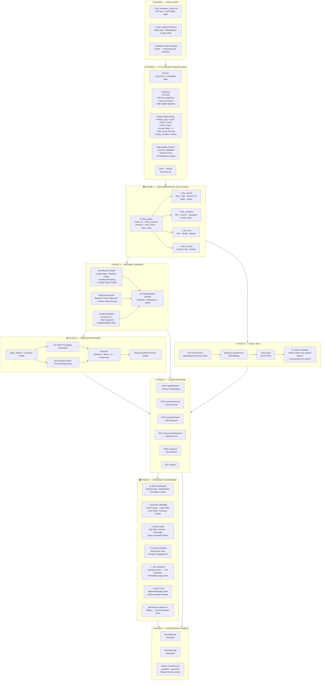

# 🚗 Vehicle Insurance Risk Analytics & Claim Prediction Platform
## Complete Project Flow Diagram & Build Order

---

## 📊 Two Datasets Available

| Dataset | Rows | Key Columns |
|---|---|---|
| [Car_Insurance_Claim.csv](file:///d:/kenexai/Dataset/Car_Insurance_Claim.csv) | 10,001 | ID, AGE, GENDER, CREDIT_SCORE, VEHICLE_TYPE, OUTCOME (0/1) |
| [motor_data14-2018.csv](file:///d:/kenexai/Dataset/motor_data14-2018.csv) | 508,502 | OBJECT_ID, INSURED_VALUE, PREMIUM, PROD_YEAR, TYPE_VEHICLE, CLAIM_PAID |

> **Strategy**: Use [motor_data14-2018.csv](file:///d:/kenexai/Dataset/motor_data14-2018.csv) as the **primary dataset** (has real PREMIUM & CLAIM_PAID amounts). Use [Car_Insurance_Claim.csv](file:///d:/kenexai/Dataset/Car_Insurance_Claim.csv) for **classification** (OUTCOME label ready).

---

## 🗺️ Full Project Architecture Flow



---

## 🏗️ Step-by-Step Build Order (What to Build First)

### ✅ STAGE 1 — Data Foundation (Days 1-2)
```
1. requirements.txt          ← Install all packages
2. src/etl_pipeline.py       ← Clean + transform both CSVs
3. src/warehouse_schema.sql  ← Create SQLite star schema
4. data/insurance.db         ← Populated from ETL
```
> ✔ Output: Clean database ready for everything else

---

### ✅ STAGE 2 — Machine Learning (Days 3-4)
```
5. src/models/train_models.py
   ├── Classification → Random Forest (predict OUTCOME)
   ├── Regression    → RF Regressor (predict CLAIM_PAID)  
   └── Clustering    → K-Means k=4 (risk segments)
6. src/models/saved/
   ├── classifier.pkl
   ├── regressor.pkl
   └── kmeans.pkl + scaler.pkl
```
> ✔ Output: Trained models saved to disk — **test these first with Python scripts before any web**

---

### ✅ STAGE 3 — Backend API (Day 5)
```
7. api/main.py (FastAPI)
   ├── /health
   ├── /predict/claim
   ├── /predict/amount
   ├── /predict/cluster
   ├── /recommend/premium
   └── /query/nl
```
> ✔ Output: Test with `curl` or Swagger UI at localhost:8000/docs

---

### ✅ STAGE 4 — GenAI / RAG (Day 6)
```
8. src/rag/rag_engine.py
   ├── Build ChromaDB vector store
   ├── Embed insurance stats as documents
   └── Query function for NL answers
```

---

### ✅ STAGE 5 — Web Dashboard (Days 7-9)
```
9. app/streamlit_app.py (Main entry)
   app/pages/
   ├── 1_EDA_Dashboard.py
   ├── 2_Manager_Dashboard.py
   ├── 3_Risk_Analyst.py
   ├── 4_Customer_Advisor.py
   ├── 5_ML_Prediction.py
   ├── 6_GenAI_Chat.py
   └── 7_Premium_Optimizer.py
```
> ✔ All pages call FastAPI for ML predictions

---

### ✅ STAGE 6 — Docker (Day 10)
```
10. Dockerfile.api
11. Dockerfile.app
12. docker-compose.yml   ← docker-compose up --build
```

---

## 📂 Final Folder Structure

```
d:\kenexai\
├── Dataset/
│   ├── Car_Insurance_Claim.csv     ← Classification dataset
│   └── motor_data14-2018.csv       ← Primary dataset (premium+claims)
├── data/
│   └── insurance.db                ← SQLite data warehouse
├── src/
│   ├── etl_pipeline.py
│   ├── data_simulator.py
│   ├── warehouse_schema.sql
│   ├── models/
│   │   ├── train_models.py
│   │   └── saved/                  ← pkl files
│   ├── rag/
│   │   └── rag_engine.py
│   └── optimizer/
│       └── premium_optimizer.py
├── api/
│   └── main.py                     ← FastAPI
├── app/
│   ├── streamlit_app.py
│   └── pages/
│       ├── 1_EDA_Dashboard.py
│       ├── 2_Manager_Dashboard.py
│       ├── 3_Risk_Analyst.py
│       ├── 4_Customer_Advisor.py
│       ├── 5_ML_Prediction.py
│       ├── 6_GenAI_Chat.py
│       └── 7_Premium_Optimizer.py
├── Dockerfile.api
├── Dockerfile.app
├── docker-compose.yml
├── requirements.txt
└── README.md
```

---

## ⚡ Quick Start Commands

```bash
# 1. Install dependencies
pip install -r requirements.txt

# 2. Run ETL (creates SQLite DB)
python src/etl_pipeline.py

# 3. Train ML models
python src/models/train_models.py

# 4. Start API
uvicorn api.main:app --reload --port 8000
# → Test at http://localhost:8000/docs

# 5. Start Dashboard (new terminal)
streamlit run app/streamlit_app.py
# → Visit http://localhost:8501

# OR — Docker all-in-one
docker-compose up --build
```

---

## 🎯 What Each Persona Sees

| Persona | Dashboard | Key Metrics |
|---|---|---|
| 👔 Insurance Manager | Manager Dashboard | Total Policies, Claim Rate %, Loss Ratio, Revenue |
| ⚠️ Risk Analyst | Risk Dashboard | High-Risk Vehicle Map, Claim Probability Heatmap, Trends |
| 🤝 Customer Advisor | Advisor Dashboard | Risk Score Card, Premium Recommendation, Customer Cluster |

---

> **Build Order Summary: Data → ML Models → API → RAG → Web UI → Docker**  
> **Do NOT build the web first — ML models must be saved before the API can serve them.**
